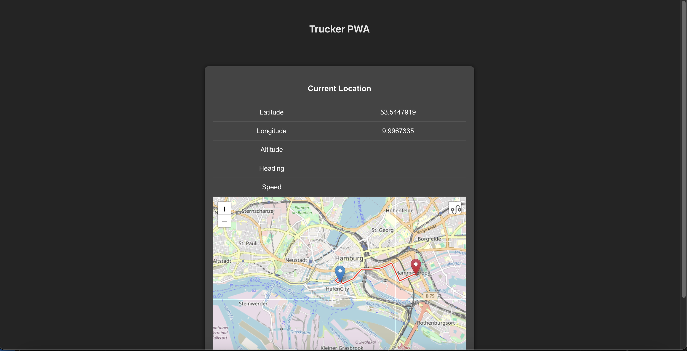

# Trucker PWA
This is a POC for a PWA that can be used instead of telematics where the systems are not installed in the existing vehicles. 

## Description
The PWA is capable of storing the following information from users:
1. Latitude
2. Longitutde
3. Altitude
4. Speed
5. Heading

The app also stores and shows the previous location as a route with the capability to filter by date 

## Getting Started

### Installing
- How/where to download your program
- Any modifications needed to be made to files/folders

### Executing program
- Use npm run dev to start the dev server

